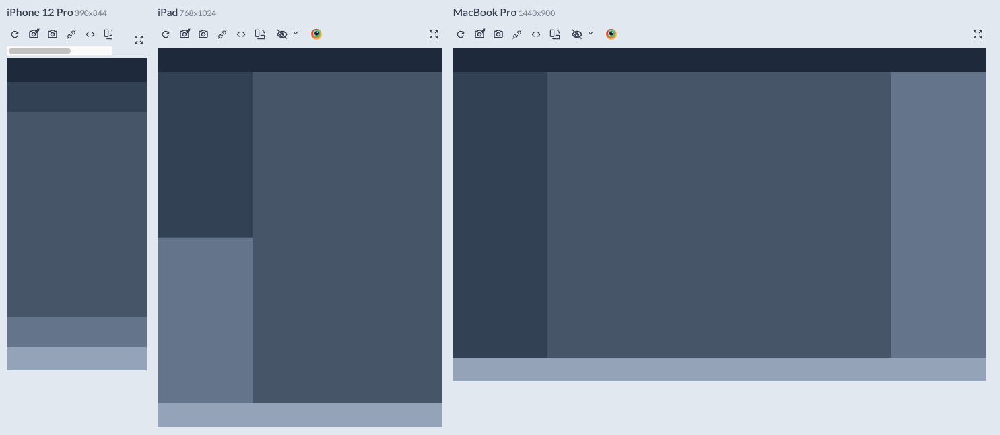

# Grid-web-Panel
- feel free to use this as model, evem the css file has a reset, and media queries desktop first. 

## Screenshots

## Links
If you want to see the final product, in the project directory, you can run:
- [Live 🔗] https://basic-grid.netlify.app/

## My process

### Built with
- Semantic HTML5 markup
- CSS Grid

## Note - Keep in mind
REMEMBER THAT IF YOUR LAYOUT IS 

DESKTOP FIRST: IN MEDIA QUERIES GO "max-width" ">"

MOBILE FIRST: IN MEDIA QUERIES GO "min-width"  "<"

## 🚀 About Me
I'm a Junior full stack developer.
